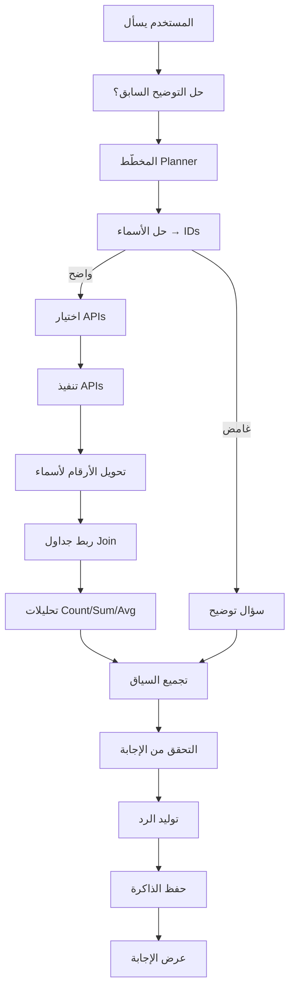

# شرح مبسّط لمعمارية المشروع

> هذا الملف للفهم السريع. للتفاصيل التقنية الكاملة راجع `PROJECT_GUIDE.md`.

---

## 1. المشروع بيعمل إيه؟

المشروع **وكيل ذكاء اصطناعي** يجاوب على أسئلة عن بيانات **ERP** (موظفين، مشاريع، أنظمة، …) بالعربي أو الإنجليزي.

مثال:
- «مين مالك نظام CRM؟»
- «كم متوسط ميزانية المشاريع؟»
- «إيه آخر سؤال سألته؟»

الوكيل **مش بيخترع بيانات**. لو محتاج معلومة من النظام → يستدعي الـ API الحقيقي (أو Mock للتجربة) ويرجع إجابة مبنية على النتيجة.

---

## 2. ليه LangChain و LangGraph؟

### LangChain — «أدوات التعامل مع الـ LLM»

LangChain مكتبة بتسهّل:

| الوظيفة | في المشروع |
|---------|------------|
| الاتصال بنموذج اللغة (Ollama) | `src/llm/ollama_client.py` |
| إرسال رسائل (system / user) | في الـ Planner والإجابة |
| مخرجات منظمة (JSON) | خطة التنفيذ `ExecutionPlan` |
| إصلاح JSON لو الـ LLM غلط | حلقة repair في `structured()` |

**باختصار:** LangChain = الطبقة اللي بتتكلم مع النموذج الذكي بشكل منظم.

---

### LangGraph — «منظم سير العمل»

لو سألت الـ LLM مباشرة: «مين مالك CRM؟» — ممكن يجاوب من خياله (هلوسة).

LangGraph بيحل المشكلة دي بإنه **يرسم مسار ثابت** (Graph) من خطوات، وكل خطوة ليها دور واضح:

```
سؤال المستخدم
    ↓
خطوة 1: فهم السؤال
    ↓
خطوة 2: تخطيط (إيه الـ APIs المطلوبة؟)
    ↓
خطوة 3: تنفيذ الـ APIs
    ↓
خطوة 4: تجهيز الإجابة
    ↓
رد للمستخدم
```

**باختصار:** LangGraph = المايسترو اللي يمشّي الخطوات بالترتيب، يحفظ الحالة، ويسمح بفروع (مثل: «محتاج توضيح من المستخدم»).

---

## 3. الخوارزمية (الـ Pipeline) — خطوة بخطوة

المشروع بيتبع النمط:

```
Plan → Route → Execute → Respond
(خطّط → وجّه → نفّذ → أجب)
```

### مخطط مبسّط



### كل مرحلة بتعمل إيه؟ (بلغة بسيطة)

| # | المرحلة | بتعمل إيه؟ |
|---|---------|------------|
| 1 | **clarification_resolver** | لو المستخدم اختار «الأول» أو «2» من قائمة توضيح سابقة، بيعيد صياغة السؤال |
| 2 | **planner** | يفهم السؤال ويطلع **خطة JSON** (مش نص حر): ابحث عن CRM → اجلب النظام → اعرض المالك |
| 3 | **entity_resolver** | يحوّل الأسماء لـ IDs. لو في أكثر من «أحمد» → يطلب توضيح |
| 4 | **api_selector** | يحوّل الخطة لاستدعاءات API محددة |
| 5 | **executor** | ينفّذ الاستدعاءات فعليًا على الـ ERP |
| 6 | **relationship_resolver** | يحوّل `ownerId: 7` → `owner: "أحمد محمد"` |
| 7 | **join** | يربط بيانات من مصدرين (مثل: مالك النظام + مشاريعه) |
| 8 | **analytics** | يحسب: عدد، مجموع، متوسط، أعلى N، … |
| 9 | **context_builder** | يضغّط النتائج في سياق جاهز للإجابة |
| 10 | **response_validator** | يتأكد إن في بيانات فعلًا (مش فاضي ولا خطأ) |
| 11 | **response_generator** | يكتب الإجابة النهائية (LLM أو رد حتمي للأرقام) |
| 12 | **memory_manager** | يحفظ حقائق مفيدة للمستقبل |

---

## 4. الـ State (الحالة) — «الذاكرة القصيرة أثناء السؤال»

أثناء معالجة سؤال واحد، LangGraph بيمرّر **كيس بيانات** اسمه `AgentState` بين كل المراحل.

أهم الحقول:

| الحقل | المعنى |
|-------|--------|
| `user_input` | سؤال المستخدم |
| `plan` | الخطة (JSON منظّم) |
| `execution_results` | نتائج الـ APIs |
| `analytics` | نتائج الحسابات |
| `final_response` | الإجابة النهائية |
| `messages` | تاريخ المحادثة (أسئلة وأجوبة سابقة) |

فكّر فيها زي **لوحة شغل** كل مرحلة بتكتب عليها وبتمشّي للي بعدها.

---

## 5. قاعدة البيانات — بتتخزّن إزاي؟

المشروع بيستخدم ملف SQLite واحد (افتراضيًا: `data/agent.db`) لـ **ثلاث حاجات مختلفة**:

### أ) Checkpoint — «حفظ المحادثة»

- **الأداة:** `langgraph-checkpoint-sqlite`
- **الغرض:** لو قفلت البرنامج وفتحته تاني، المحادثة تكمل من حيث وقفت
- **المفتاح:** `thread_id` (معرّف المحادثة — مثل `cli-default`)
- **بيتحفظ إيه:** الحالة الكاملة لكل جولة (الخطة، النتائج، الرسائل، …)

### ب) الذاكرة طويلة المدى — «حقائق تُتذكّر لاحقًا»

- **الجدول:** `memories`
- **الأعمدة:** `thread_id`, `content`, `kind`, `importance`, `created_at`
- **مثال:** «مالك نظام CRM هو أحمد محمد»
- **البحث:** كلمات مفتاحية (LIKE) — مش بحث دلالي متقدم حاليًا
- **متى يُحفظ:** فقط الإجابات الناجحة المهمة (مش كل كلمة)

### ج) الكاش — «تسريع الاستدعاءات»

- **مش في SQLite** — في الذاكرة (RAM)
- يخزّن نتائج GET الناجحة لمدة محددة (افتراضي 5 دقائق)
- يقلّل تكرار نفس طلب الـ API

```
┌─────────────────────────────────────────┐
│           data/agent.db (SQLite)         │
├─────────────────────────────────────────┤
│  Checkpoint tables  →  حالة LangGraph    │
│  memories table     →  ذاكرة طويلة المدى │
└─────────────────────────────────────────┘

┌─────────────────────────────────────────┐
│         RAM (TTLCache)                   │
│  نتائج APIs مؤقتة للتسريع               │
└─────────────────────────────────────────┘
```

---

## 6. طبقات المشروع (من فوق لتحت)

```
┌──────────────────────────────────┐
│  CLI (واجهة الطرفية)             │  ← المستخدم يكتب هنا
├──────────────────────────────────┤
│  LangGraph (العُقد / Nodes)       │  ← تنسيق الخطوات
├──────────────────────────────────┤
│  Planner + Services              │  ← التخطيط + منطق الأعمال
├──────────────────────────────────┤
│  Adapters + Auth + LLM           │  ← HTTP للـ ERP + Ollama
├──────────────────────────────────┤
│  Config (JSON/YAML)              │  ← كتالوج APIs بدون كود جديد
└──────────────────────────────────┘
```

**قاعدة مهمة:** العُقد (Nodes) **مش بتستدعي APIs مباشرة** — بتستدعي **Services**. ده بيخلي الكود منظم وقابل للاختبار.

---

## 7. ليه الحل ده أفضل من البدائل؟

### مقارنة سريعة

| البديل | المشكلة | حلنا |
|--------|---------|------|
| **سؤال مباشر للـ LLM** | هلوسة — يختلق أسماء وأرقام | البيانات من APIs فقط |
| **ReAct Agent** (فكر → نفّذ → فكر → …) | غير متوقع، صعب التتبع والاختبار | Pipeline ثابت ومرئي |
| **كود ثابت لكل سؤال** | كل سؤال جديد = كود جديد | Config-driven من `api_registry.json` |
| **LLM يختار API عشوائي** | ممكن يختار endpoint غلط | Planner يطلع خطة JSON مُتحقَّق منها |
| **حفظ كل المحادثة** | ضوضاء وذاكرة ملوّثة | نحفظ الحقائق المهمة فقط |

### المميزات الرئيسية

1. **موثوقية** — الأرقام والتحليلات تُحسب برمجيًا (مش الـ LLM يحسب)
2. **شفافية** — أمر `/trace` يوريك كل مرحلة ووقتها
3. **قابلية التوسع** — API جديد = سطر في ملف إعداد، مش إعادة كتابة الوكيل
4. **استمرارية** — SQLite checkpoint يحفظ المحادثة بين الجلسات
5. **مرونة** — Mock ERP للتطوير، ERP حقيقي بـ `.env`
6. **أمان** — مفاتيح API في `.env`، مش في الكود
7. **تدهور آمن** — لو API أو LLM فشل، البرنامج مش بيقع — بيرجع رسالة واضحة

---

## 8. مثال عملي كامل

**السؤال:** «مين مالك نظام CRM؟»

```
1. Planner يفهم ويطلع خطة:
   - ابحث في systems عن "CRM"
   - اجلب النظام بالـ id
   - اعرض مفهوم "owner"

2. Entity Resolver يجد: systems.id = 3

3. Executor يستدعي:
   GET /api/systems/3
   → { "name": "CRM", "ownerId": 7 }

4. Relationship Resolver يستدعي:
   GET /api/people/7
   → يضيف: "owner": "أحمد محمد"

5. Response Generator يكتب:
   «مالك نظام CRM هو أحمد محمد.»

6. Memory Manager يحفظ (لو الإجابة مهمة):
   «مالك نظام CRM: أحمد محمد»
```

لو السؤال كان «كم متوسط ميزانية المشاريع؟» — الخطوة 8 (analytics) تحسب الرقم **حتميًا** والـ LLM بس يلخّصه بجملة، مش يخترع الرقم.

---

## 9. الملفات المهمة للفهم

| الملف | دوره |
|-------|------|
| `src/graph/builder.py` | تجميع LangGraph + تشغيل الوكيل |
| `src/models/state.py` | شكل الحالة بين المراحل |
| `src/models/plan.py` | شكل الخطة (JSON) |
| `config/api_registry.json` | كل APIs المتاحة |
| `config/facets.yaml` | الكيانات (people, projects, …) |
| `schema/semantic_catalog.yaml` | مفاهيم الأعمال (مالك، قسم، …) |
| `data/agent.db` | Checkpoint + ذاكرة طويلة المدى |
| `mock_erp/server.py` | ERP وهمي للتجربة |

---

## 10. ملخص في جملة واحدة

> **LangChain** يتكلم مع النموذج الذكي، و**LangGraph** يمشّي خطوات ثابتة (خطّط → نفّذ APIs → أجب)، و**SQLite** يحفظ المحادثة والذاكرة — عشان الوكيل يكون **دقيق، قابل للتتبع، ومش بيختلق بيانات ERP.**

---

*للتفاصيل التقنية الكاملة (كل كلاس، كل حقل، كل اختبار): راجع `PROJECT_GUIDE.md`.*
