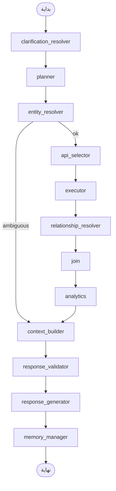

# دليل المشروع — التركيبة ومسؤولية كل ملف

> **الغرض من هذا الملف:** مرجع سريع عند العودة للمشروع. يوضح شكل النظام، تدفق البيانات، و**أي ملف تعدّل** حسب نوع التغيير الذي تريده.
>
> للتشغيل السريع راجع `README.md`.

---

## 1. نظرة عامة

المشروع **وكيل ذكاء اصطناعي طرفي (Terminal)** يجيب على أسئلة بالعربية أو الإنجليزية عن بيانات ERP عبر:

1. **تخطيط** (خطة JSON منظمة — ليس نصًا حرًا)
2. **تنفيذ APIs** من كتالوج ديناميكي
3. **معالجة** (ربط مفاتيح أجنبية، joins، تحليلات)
4. **إجابة** موجزة مع تحقق من عدم الهلوسة

لا يوجد واجهة ويب. الـ LLM محلي عبر **Ollama**. الـ ERP إما **Mock** (`mock_erp`) أو **حقيقي** عبر `.env`.

### الطبقات (من الأعلى للأسفل)

```
┌─────────────────────────────────────────────────────────┐
│  cli.py              واجهة المحادثة في الطرفية          │
├─────────────────────────────────────────────────────────┤
│  graph/builder.py    تجميع LangGraph + AgentRuntime     │
│  nodes/*             مراحل الـ pipeline (بدون منطق ERP) │
├─────────────────────────────────────────────────────────┤
│  planner/            إنتاج ExecutionPlan              │
│  services/           منطق الأعمال (API، joins، تحليل)  │
├─────────────────────────────────────────────────────────┤
│  adapters/ + auth/   HTTP + توكنات ERP                  │
│  llm/                Ollama + JSON structured           │
├─────────────────────────────────────────────────────────┤
│  config/ + schema/   كتالوج APIs، facets، مفاهيم       │
│  mock_erp/           خادم تجريبي + JSON وهمي            │
└─────────────────────────────────────────────────────────┘
```

**قاعدة مهمة:** عُقد LangGraph (`nodes/`) **لا تستدعي APIs مباشرة** — تستدعي `services/` فقط. الـ adapters للنقل فقط.

---

## 2. مخطط التدفق (LangGraph)



| العقدة | الملف | ماذا تفعل |
|--------|-------|-----------|
| `clarification_resolver` | `nodes/clarification.py` | إن كان المستخدم يجيب على سؤال توضيح سابق («الأول»، «2»)، يحل الاختيار قبل التخطيط |
| `planner` | `nodes/planner.py` | يجلب ذاكرة طويلة المدى + يبني `ExecutionPlan` |
| `entity_resolver` | `nodes/entity_resolver.py` | يحوّل الأسماء → IDs عبر search APIs |
| `api_selector` | `nodes/api_selector.py` | يختار endpoints من الـ registry حسب الخطة |
| `executor` | `nodes/executor.py` | ينفّذ الاستدعاءات عبر `ApiClient` |
| `relationship_resolver` | `nodes/relationship_resolver.py` | يحوّل FK ids → أسماء مقروءة |
| `join` | `nodes/join.py` | يربط صفوف خطوتين (cross-entity join) |
| `analytics` | `nodes/analytics.py` | count/sum/avg/group على صفوف list |
| `context_builder` | `nodes/context_builder.py` | يضغط النتائج أو يبني سؤال توضيح / recall |
| `response_validator` | `nodes/response_validator.py` | `ok` / `empty` / `error` |
| `response_generator` | `nodes/response_generator.py` | الإجابة النهائية (LLM أو حتمية) |
| `memory_manager` | `nodes/memory_manager.py` | يحفظ حقائق مفيدة فقط |

**فرع خاص:** إذا `entity_resolver` وجد أكثر من مرشح → `clarification.needed=true` → يتخطى التنفيذ ويذهب مباشرة لـ `context_builder` ليسأل المستخدم.

**نقطة الدخول للتجميع:** `src/graph/builder.py` — عدّل هنا فقط إذا أضفت عقدة جديدة أو غيّرت الترتيب.

**حقن التبعيات:** `src/graph/dependencies.py` — كل ما تحتاجه العقد مجمّع في `PipelineDeps`.

---

## 3. حالة الوكيل `AgentState`

الملف: `src/models/state.py`

| الحقل | من يكتبه | المعنى |
|-------|----------|--------|
| `user_input` | CLI / `AgentRuntime.ask` | سؤال المستخدم الحالي |
| `thread_id` | CLI | معرّف المحادثة (checkpoint + ذاكرة) |
| `messages` | planner, response_generator | تاريخ قصير المدى (يُدمج عبر `operator.add`) |
| `plan` | planner | خطة التنفيذ JSON |
| `language` | planner | `ar` / `en` … |
| `retrieved_memories` | planner | ذاكرة طويلة المدى ذات صلة |
| `resolved_entities` | entity_resolver | `step_id → {id, label, record}` |
| `clarification` | entity_resolver / clarification_resolver | حالة التوضيح بين الجولات |
| `selected_apis` | api_selector | endpoints المختارة |
| `execution_results` | executor | نتائج خام من APIs |
| `resolved_results` | relationship_resolver, join | بعد حل العلاقات / join |
| `analytics` | analytics | نتائج aggregate |
| `context` | context_builder | بيانات مضغوطة للإجابة |
| `validation` | response_validator | حالة التحقق |
| `final_response` | response_generator | النص المعروض للمستخدم |
| `errors` | عدة عقد | أخطاء غير قاتلة |
| `trace` | كل عقدة | توقيت كل مرحلة (`/trace` في CLI) |

---

## 4. الخطة `ExecutionPlan`

الملف: `src/models/plan.py`

### نوايا السؤال `PlanIntent`

| القيمة | متى | أين تُجاب |
|--------|-----|-----------|
| `data` | سؤال عن ERP | pipeline كامل |
| `recall` | «إيه آخر سؤال؟» | `conversation.py` + context_builder |
| `chat` | تحية / معرفة عامة | response_generator + `chat.md` (+ Tavily اختياري) |

### أنواع الخطوات `StepKind`

| النوع | الاستخدام |
|-------|-----------|
| `search` | بحث بالاسم → id |
| `get_by_id` | جلب سجل واحد |
| `list` | قائمة كل سجلات facet |
| `api` | endpoint صريح من registry |
| `concept` | مفهوم من `semantic_catalog.yaml` |
| `aggregate` | تحليل (count, sum, avg, group_by, filters) — يحتاج `aggregate:` في الخطوة |
| `join` | ربط خطوتين — يحتاج `join:` في الخطوة |

**التخطيط:** `src/planner/llm_planner.py` (LLM) + `src/planner/fallback_planner.py` (قواعد عند فشل LLM).

**تعديل سلوك التخطيط:** `src/prompts/planner.md` ثم المنطق في `llm_planner.py` / `fallback_planner.py`.

---

## 5. ماذا تعدّل؟ (دليل سريع)

| تريد أن… | عدّل |
|----------|------|
| تضيف API جديد للـ ERP | `config/api_registry.json` أو discovery من `config/sources/` |
| تضيف كيان (facet) جديد | `config/facets.yaml` + بيانات mock أو API حقيقي |
| تربط حقل FK باسم مقروء | `relationships` داخل `config/facets.yaml` |
| تضيف مفهوم أعمال («عقود نشطة») | `schema/semantic_catalog.yaml` |
| تغيّر بيانات التجربة | `mock_erp/data/*.json` + endpoints في `mock_erp/server.py` |
| تربط ERP حقيقي | `.env` (`ERP_ADAPTER=real`) + registry من OpenAPI |
| تغيّر نموذج Ollama / GPU | `.env` (`OLLAMA_MODEL`, `OLLAMA_NUM_GPU`) |
| تفعّل بحث الويب | `.env` (`TAVILY_API_KEY`) + `web_search_service.py` |
| تغيّر صياغة التخطيط | `src/prompts/planner.md` |
| تغيّر صياغة الإجابة على بيانات | `src/prompts/response.md` |
| تغيّر المحادثة العامة | `src/prompts/chat.md` |
| تغيّر قرار «هل أبحث في الويب؟» | `src/prompts/web_decision.md` |
| تضيف عقدة pipeline | `src/nodes/` + `src/graph/builder.py` |
| تضيف منطق HTTP / retry | `src/adapters/http_adapter.py`, `src/services/api_client.py` |
| تضيف خوارزمية join | `src/services/joins/` (مثل `nested_loop.py`) |
| تضيف عملية تحليل | `src/models/plan.py` (`AggregateOp`) + `analytics_service.py` |
| توضيح اسم مزدوج (أحمد ×3) | `nodes/clarification.py`, `entity_resolver.py`, `context_builder.py` |
| ذاكرة طويلة المدى | `src/memory/sqlite_repository.py` |
| checkpoint محادثة | `SQLITE_PATH` + `graph/builder.py` (`AsyncSqliteSaver`) |
| إعدادات عامة | `src/config/settings.py` + `.env.example` |
| واجهة الطرفية | `src/cli.py` |
| اختبارات | `tests/test_*.py` |

---

## 6. شجرة الملفات ومسؤولية كل جزء

```
ai-agent-for-api/
│
├── .env                    # إعداداتك المحلية (سري — لا يُرفع لـ Git)
├── .env.example            # قالب كل المتغيرات
├── requirements.txt        # اعتماديات pip
├── pyproject.toml          # إعداد pytest / ruff / setuptools
├── README.md               # تشغيل سريع
├── PROJECT_GUIDE.md        # ← هذا الملف
│
├── config/
│   ├── api_registry.json       # كتالوج كل endpoints (اسم، URL، method، facet)
│   ├── facets.yaml             # كيانات ERP: search/get/list + علاقات FK
│   └── sources/
│       ├── openapi.json            # مصدر discovery (OpenAPI)
│       └── postman_collection.json # مصدر discovery (Postman)
│
├── schema/
│   └── semantic_catalog.yaml   # مفاهيم أعمال → APIs (لخطوات concept)
│
├── mock_erp/                   # ERP وهمي للتطوير
│   ├── server.py               # FastAPI على :8000
│   └── data/
│       ├── people.json
│       ├── org_units.json
│       ├── systems.json
│       ├── datasets.json
│       ├── projects.json
│       ├── stakeholders.json   # بيانات فرعية (عبر APIs متداخلة)
│       └── interfaces.json
│
├── data/                       # يُنشأ محليًا (غير في Git عادة)
│   └── agent.db                # SQLite: checkpoint LangGraph + ذاكرة طويلة
│
├── src/
│   ├── cli.py                  # REPL: /help /trace /new /exit
│   │
│   ├── graph/
│   │   ├── builder.py          # بناء Graph + AgentRuntime.ask()
│   │   └── dependencies.py     # PipelineDeps (حقن التبعيات)
│   │
│   ├── nodes/                  # مراحل LangGraph (رفيعة — تنسيق فقط)
│   │   ├── clarification.py    # حل رد التوضيح + helpers للغموض
│   │   ├── planner.py
│   │   ├── entity_resolver.py
│   │   ├── api_selector.py
│   │   ├── executor.py
│   │   ├── relationship_resolver.py
│   │   ├── join.py
│   │   ├── analytics.py
│   │   ├── context_builder.py
│   │   ├── response_validator.py
│   │   ├── response_generator.py
│   │   ├── memory_manager.py
│   │   ├── conversation.py     # recall حتمي (ليس عقدة graph)
│   │   └── _helpers.py         # append_trace, append_errors
│   │
│   ├── planner/
│   │   ├── llm_planner.py      # خطة من LLM + structured output
│   │   └── fallback_planner.py # خطة قواعدية عند الفشل
│   │
│   ├── services/               # منطق الأعمال
│   │   ├── api_client.py       # استدعاء endpoint + cache
│   │   ├── facet_service.py    # search/get/list حسب facet
│   │   ├── analytics_service.py # تنفيذ aggregate steps
│   │   ├── web_search_service.py # Tavily (اختياري)
│   │   └── joins/
│   │       ├── engine.py       # تنسيق استراتيجيات join
│   │       ├── nested_loop.py  # خوارزمية join الافتراضية
│   │       └── base.py         # واجهة استراتيجية join
│   │
│   ├── adapters/
│   │   ├── base.py             # بروتوكول ERPAdapter
│   │   ├── mock_adapter.py     # يوجّه لـ mock server
│   │   ├── real_adapter.py     # ERP حقيقي
│   │   ├── http_adapter.py     # طبقة HTTP مشتركة
│   │   └── factory.py          # build_adapter + build_http_client
│   │
│   ├── auth/
│   │   └── auth_manager.py     # login / token / refresh
│   │
│   ├── cache/
│   │   └── memory_cache.py     # TTL cache لنتائج البحث
│   │
│   ├── config/
│   │   ├── settings.py         # Pydantic Settings من .env
│   │   └── registry.py         # تحميل JSON/YAML → Registry
│   │
│   ├── discovery/              # توليد api_registry.json
│   │   ├── generator.py        # CLI: python -m src.discovery.generator
│   │   ├── base.py             # واجهة ApiSource
│   │   ├── openapi_source.py
│   │   ├── postman_source.py
│   │   └── manual_source.py
│   │
│   ├── llm/
│   │   └── ollama_client.py    # ChatOllama + JSON repair loop
│   │
│   ├── memory/
│   │   ├── repository.py       # بروتوكول الذاكرة
│   │   └── sqlite_repository.py # تخزين + بحث keyword
│   │
│   ├── models/                 # Pydantic / TypedDict
│   │   ├── state.py            # AgentState
│   │   ├── plan.py             # ExecutionPlan, PlanStep, Join, Aggregate
│   │   ├── api.py              # ApiEndpoint, FacetDef, ApiResult
│   │   ├── semantic.py         # ConceptDef, SemanticCatalog
│   │   ├── analytics.py        # AnalyticsResult
│   │   └── web.py              # WebSearchDecision, WebSearchResult
│   │
│   ├── prompts/
│   │   ├── __init__.py         # render("planner", ...)
│   │   ├── planner.md
│   │   ├── response.md
│   │   ├── chat.md
│   │   └── web_decision.md
│   │
│   ├── observability/
│   │   ├── logging.py          # structlog
│   │   └── traces.py           # مساعدات trace
│   │
│   └── tools/
│       └── tool_factory.py     # أدوات ديناميكية من registry (للتوسع)
│
└── tests/
    ├── conftest.py
    ├── test_discovery.py
    ├── test_registry.py
    ├── test_fallback_planner.py
    ├── test_llm_planner.py
    ├── test_entity_resolver.py
    ├── test_clarification.py
    ├── test_clarification_graph.py
    ├── test_executor.py
    ├── test_facet_service.py
    ├── test_relationship_resolver.py
    ├── test_joins.py
    ├── test_join_node.py
    ├── test_analytics_service.py
    ├── test_analytics_node.py
    ├── test_context_builder_analytics.py
    ├── test_validator.py
    ├── test_response_generator.py
    ├── test_conversation.py
    ├── test_web_search_service.py
    └── test_cache.py
```

---

## 7. ملفات الإعداد بالتفصيل

### `config/api_registry.json`

كل مفتاح = اسم API (مثل `people.search`):

- `url`, `method`
- `path_params`, `query_params`, `body_params`
- `facet` (اختياري)
- `description`

**يُحمّل في:** `config/registry.py` → `Registry.endpoints`

### `config/facets.yaml`

لكل facet (مثل `projects`):

- `business_name` — الاسم المعروض للمستخدم
- `search_api`, `get_by_id_api`, `list_api` — أسماء من registry
- `relationships` — تحويل `ownerId` → `owner` (اسم شخص)

**Facets الحالية:** `people`, `org_units`, `systems`, `datasets`, `projects`

### `schema/semantic_catalog.yaml`

يربط **مفاهيم** (`active_contracts`) بـ facet + فلاتر + API. يستخدمها `api_selector` وخطوات `concept`.

### `config/sources/*`

ملفات مصدر فقط — شغّل:

```bash
python -m src.discovery.generator --source openapi config/sources/openapi.json
```

لإعادة بناء `api_registry.json`.

---

## 8. الذاكرة (ثلاث مستويات)

| المستوى | أين | الغرض |
|---------|-----|--------|
| قصيرة المدى | `state["messages"]` | آخر أسئلة وأجوبة في نفس الـ thread |
| Checkpoint | `data/agent.db` (LangGraph) | استئناف المحادثة بعد إعادة التشغيل |
| طويلة المدى | جدول `memories` في نفس SQLite | حقائق تُسترجع في `planner` (keyword search) |

**لا تحفظ كل محادثة** — `memory_manager` يطبّق سياسة أهمية فقط.

---

## 9. مسار سؤال ERP نموذجي

مثال: *«مين مالك نظام CRM؟»*

1. **planner** → `intent=data`, خطوات: `search systems "CRM"` → `get_by_id`
2. **entity_resolver** → id للنظام
3. **api_selector** → `systems.get_by_id`
4. **executor** → سجل النظام مع `ownerId`
5. **relationship_resolver** → `owner: "أحمد ..."`
6. **join / analytics** → تخطي إن لم تكن في الخطة
7. **context_builder** → حقائق مضغوطة
8. **response_validator** → `ok`
9. **response_generator** → جملة عربية من `response.md` + LLM
10. **memory_manager** → قد يحفظ حقيقة إن كانت مفيدة

---

## 10. Mock ERP

| ملف | دور |
|-----|-----|
| `mock_erp/server.py` | تعريف routes FastAPI مطابقة للـ registry |
| `mock_erp/data/*.json` | قواعد البيانات الوهمية |

عند إضافة facet جديد: أضف JSON + routes في `server.py` + سطر في `facets.yaml` + entries في `api_registry.json`.

---

## 11. الاختبارات

```bash
pytest
```

كل ملف `tests/test_*.py` يغطي وحدة واحدة — راجع الجدول في القسم 6 عند تعديل ملف مصدر.

---

## 12. ملاحظات معمارية (ثابتة)

1. **Plan → Route → Execute → Respond** — التخطيط منفصل عن التنفيذ.
2. **لا بيانات وهمية من LLM** لأسئلة ERP — إما API أو «لا توجد بيانات».
3. **Structured output** — الخطة دائمًا Pydantic JSON.
4. **Graceful degradation** — فشل ذاكرة أو API لا يوقف الـ REPL.
5. **Prompts في ملفات** — لا تضع نصوص طويلة داخل `nodes/`.

---

*آخر تحديث للدليل: يعكس pipeline مع clarification، join، analytics، و facet `projects`.*
